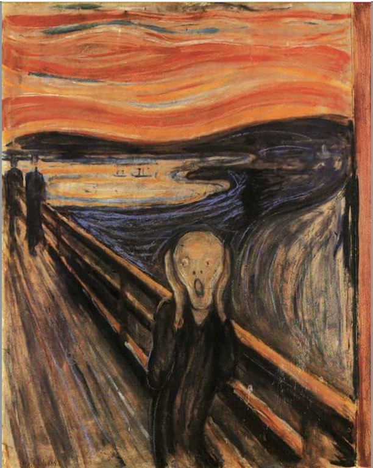
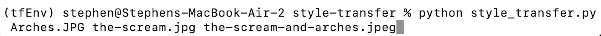

# Style Transfer
## Stylize Images in the Aesthetic of Other Works

Content Image              |  Style Image
:-------------------------:|:-------------------------:
  |  

### Dependencies
* [Matplotlib](https://matplotlib.org/stable/users/installing.html): popular pythonic plotting library 
* [Numpy](https://numpy.org/install/): popular package for scientific computing, data science objects
* [Pillow](https://pillow.readthedocs.io/en/stable/installation.html): popular image processing library for python
* [Tensorflow](https://www.tensorflow.org/install): machine learning package for python (*note*: requires macOS 10.12.6 Sierra or later) 
### Instructions
Place all images of use (content and style as described below) in the **/images** folder. The main and only python file, **style_transfer.py**, takes three inputs:
1. The name of the content image (that is, the image you wish to mutate)
2. The name of the style image (that is, the image you wish to apply to the content as a style)
3. The name of the new image file  

### Breakdown and Analysis